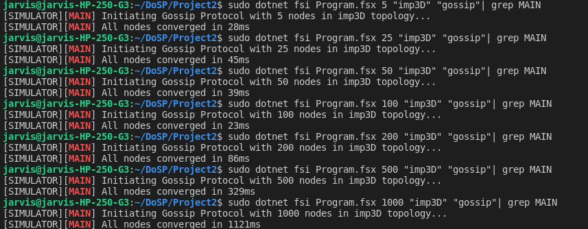
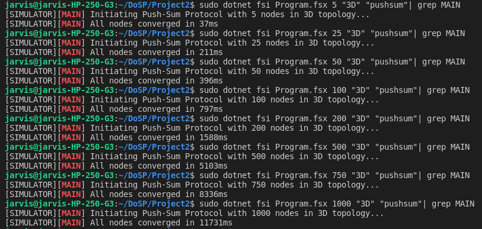
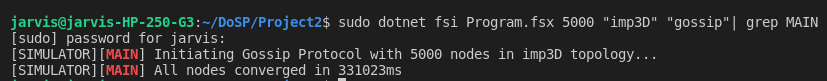
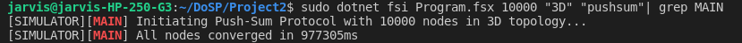

## Team Members
- Rishabh Jaiswal (rishabh.jaiswal@ufl.edu)
- Siddhesh Patil (siddheshpatil@ufl.edu)

## What is working?
We are able to simulate all topologies, algorithms, including **bonus** part.

### Explanation

- We are spawning two kinds of actors:
  - <ins>Simulator:</ins> Only responsible for creating topology, randomly selecting a node to start gossip/push-sum and terminating system if all nodes have converged. **Simulator doesn't supervise Node actors.** Node actors are truely decentralized, independent, and require no supervision. 
  - <ins>Node:</ins> Node actors have list of neighbors provided by Simulator, S/W values (in case of pushsum). We are not maintaining global variables, all nodes are independently responsible for maintaining their own states.
- <ins>Gossip:</ins>

   1. Simulator asks one random node to start gossip.
   2. Node continuously propogates gossip to the neighbors, while continuously listening for messages.
   3. Once, a node receives gossip 10 times, it declares itself as converged and stops sending gossips. Even if converged, node is alive to just listen to messages without performing any action.
   4. Node informs simulator once it is converged, Simulator only keeps tracks of number of nodes in the network which are not yet converged. Once the count becomes 0, Simulator terminates the system.
- <ins>PushSum:</ins>
    1. Each node initially has a pair of (s,w) where s is their node number and w is 1.
    2. Simulator asks one random node to start the pushsum.
    3. As soon as a node receives a "start" message it continously sends (s/2,w/2) to one of its neighbors, therefore giving them a "start" signal as well. Also, node updates its (s,w) to (s/2,w/2).
    4. On receving a pushsum, node adds it to its own (s,w) pair and sends new sum (s_new/2, w_new/2) to another neighbor.
    5. Once the ratio of s/w stops changing more than 10x-10 for 3 consequtive times, the node declares itself as converged.
    6. Simulator only keeps tracks of number of nodes in the network which are not yet converged. Once the count becomes 0, Simulator terminates the system.

- <ins>Bonus:</ins>
    1. In order to handle temporary or permanent failures, we are keeping track of ACK messages. Failure model as an parameter is controlled by number of lost ACK messages the node will tolerate before declaring the neighbor as inactive/failed/dead. 
    2. Everytime a node sends a message to it's neighbor, it increments ACK count for that particular neighbor. Neighbor sends an ACK message back to the node, and the node decrements the ACK count. 
    3. If this ACK count keeps on piling up (like, more than 5), node considers it's neighbor as dead, and makes ACK count -1.
    4. If this neighbor returns back alive (temporary failure) and sends a message back to this node, the node resets the ACK count to 0, signifying neighbor is now alive.

### How to run
Command:
`dotnet fsi Program.fsx <num_of_nodes> <topology> <algorithm>`

Topology: `full`, `line`, `3D`, `imp3D`

Algorithm: `gossip`, `pushsum`

Usage:
`dotnet fsi Program.fsx 100 "imp3D" "gossip"`

### Screenshots:

Gossip - Imp3D upto 1,000 nodes readings

Pushsum - 3D upto 1,000 nodes readings

Gossip - 5,000 nodes Imp3D reading

Pushsum - 10,000 nodes 3D reading

## What is the largest network you managed to deal with for each type of topology and algorithm?
| Algorithm      | Topology | Nodes | Time (milliseconds)
| ----------- | ----------- | ------| ------------- |
| Gossip | Full | 1000  | 2,240 |
| Gossip | Line |750 |116,375 | 
| Gossip | 3D | 1000 | 1,443|
| Gossip | Imp3D | 10,000 | 331,023 |
| Pushsum | Full | 200 |157,868 |
| Pushsum | Line |1000 | 22,956| 
| Pushsum | 3D |10,000 | 977,305 |
| Pushsum | Imp3D | 1000|8,908 |

For Push-Sum, we managed to deal with maximum of 10,000 nodes in a 3D topology with convergence time as 977,305 ms.
For Gossip, we managed to deal with maximum of 5,000 nodes in a imp3D topology with convergence time as 331,023 ms.
